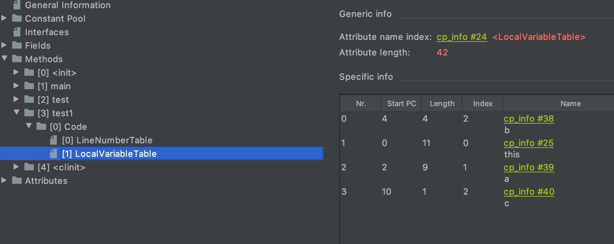
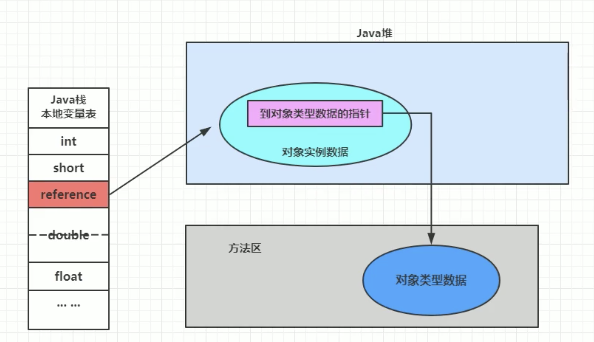

JVM整体结构


#### JVM的架构模型

Java编译器输入指令流是基于**栈的指令集架构**

- 栈式架构：
  + 设计实现简单（出栈入栈），适用于资源受限的系统
  + 避开寄存器分配，使用零地址指令方式分配
  + 指令流中指令大部分是零地址指令（没有地址，只有操作数），执行操作过程依赖于操作栈，指令集小，编译器容易实现
  + 不需要硬件支持（依赖的是内存），可移植性好，更好实现跨平台
- 寄存器架构：
  - 指令集架构依赖硬件，可移植性差
  - 大部分情况，基于寄存器架构指令集都以一地址、二地址、三地址指令为主（有些数可能占用多个地址值）
  - 性能优秀，执行更高效（依赖的是CPU寄存器）
  - 指令更少（寄存器中指令基于16位）


#### JVM的生命周期

- 虚拟机的启动：

  Java虚拟机启动是通过引导类加载器（bootstrap class loader）创建一个初始类（initial class）来完成的，这个类具体由虚拟机具体实现指定

- 虚拟机的执行：

  执行一个所谓的Java程序的时候，其实是在执行Java虚拟机的进程

- 虚拟机的退出：

  正常结束、异常错误终止、操作系统错误导致Java虚拟机进程终止、调用Runtime或System类的exit，halt方法


####HotSpot虚拟机

- 服务器端、桌面应用、嵌入式等多用途VM
- 通过计数器找到最具编译价值代码，触发即时变异或栈上替换
- 通过编译器与解释器协同工作，在最优化的程序相应时间与最佳执行性能中取得平衡


##类加载器子系统

- 类加载器子系统负责从文件系统或者网络中加载Class文件，Class文件在文件开头有特定的文件标识

- ClassLoader只负责Class文件的加载，是否可以运行由Execution Engine决定

- 加载的类信息存放于方法区的内存空间。除了类信息，方法区还会存放运行时常量池信息，可能包括字符串字面量和数字常量（这部分常量信息是Class文件中常量池部分的内存映射）

  

#####类加载器的分类

- JVM支持两种类型的类加载器，**引导类加载器（Boostrap ClassLoader）**和 **自定义加载器（User-Defined ClassLoader）**
- JVM规范定义将所有派生于抽象类ClassLoader的类加载器都划分为自定义加载器


- 引导类加载器
  - 不继承java.lang.ClassLoader，使用C/C++实现，嵌套在JVM内部
  - 加载Java核心库（JAVA_HOME/jre/lib/rt.jar、recouces.jar、sun.boot.class.path路径下的内容）
  - 加载扩展类加载器和系统类加载器，并指定为他们的父类加载器
  - 出于安全考虑，Bootstrap启动类加载器只加载包名为java、javax、sun等开头的类
- 扩展类加载器（ExtClassLoader）
  - 派生于ClassLoader类，sun.misc.Launcher$ExtClassLoader实现，父加载器为引导类加载器
  - 从java.ext.dirs系统属性所指定的目录或JDK安装目录的jre/lib/ext子目录下 加载类库（用户创建的jar放在此目录下也会加载）
- 系统类加载器（AppClassLoader）
  - 派生于ClassLoader类，sun.misc.Launcher$AppClassLoader实现，父加载器为引导类加载器
  - 负责加载环境变量classpath或系统属性java.class.path指定路径下的类库
  - **系统类加载器是程序中默认的类加载器**，Java应用的类都是由它来完成加载

```
				// 系统类加载器
        ClassLoader systemClassLoader = ClassLoader.getSystemClassLoader();

        // 扩展类加载器
        ClassLoader extClassLoader = systemClassLoader.getParent();

        // 引导类加载器
        ClassLoader bootstrapClassLoader = extClassLoader.getParent();

        // 用户自定义类加载器: 默认使用系统类加载器
        ClassLoader classLoader = ClassLoaderTest.class.getClassLoader();

        // 引导类加载器: Java的核心类库都是使用引导类加载器加载的
        ClassLoader stringClassLoader = String.class.getClassLoader();

```


#####类的加载过程


- Loading:
  1. 通过一个类的全限定名获取定义此类的二进制字节流
  2. 将这个字节流所代表的静态存储结构转化为方法区的运行时数据结构
  3. **在内存中生成一个代表这个类的java.lang.Class对象**，作为方法区这个类的各种数据的访问入口

- Linking：

  - Verification：
    1. 确保Class文件的字节流符合虚拟机要求
    2. 主要包括四种验证：文件格式验证、元数据验证、字节码验证、符号引用验证

  - Prepare：

    1. 为类变量（静态变量）分配内存并且设置该类变量的默认初始值

       ```
       private static a = 1; //prepare只会给a一个默认初始化的值0，在initial中才会显式初始化
       ```

    2. **不包括用final修饰的类变量，因为final在编译时就分配了默认值，准备阶段会显式初始化**

       ```
       private static final int a = 1; // final修饰的代表常量，默认初始化在编译的时候就已经完成，prepare会显式初始化
       ```

    3. **不会为实例变量（成员变量）分配初始化**，类变量会分配在方法区中，而实例变量会随着对象一起分配到堆中

  - Resolve:

    1. Resolve操作伴随着JVM在执行完初始化之后再执行

    2. Resolve操作就是将常量池内的符号引用（JVM规范中一组符号来描述所引用的目标）转换为直接引用（直接指向目标的指针、相对偏移量、句柄）的过程

    3. Resolve动作主要针对类或接口、字段、类方法、接口方法、方法类型等

       ```
       CONSTANT_Class_info
       CONSTANT_Fieldref_info
       CONSTANT_Methodref_info
       ...
       ```

- Initialization:

  1. 初始化阶段就是执行类构造器方法<clinit>()的过程，如果一个类没有类变量和静态代码块，则不会有<clinit>()，<clinit>()不同于类的构造器，是由javac编译器自动收集类中的所有**类变量的赋值动作和静态代码块中的语句**合并

     

  2. 构造器方法<clinit>()中指令按语句在源文件中出现的顺序执行

     

  3. 若该类具有父类，JVM会先执行父类的<clinit>()

  4. 虚拟机必须保证一个类的<clinit>()方法在多线程下被同步加锁（保证一个类只初始化一次，初始化后放入本地内存->方法区）

##### 用户自定义类加载器

为什么要自定义类加载器？

- 隔离加载类（中间件与应用程序类的冲突）
- 修改类的加载方式（按需加载）
- 扩展加载源（从DB等中获取）
- 防止源码泄漏（解密Class文件）


#### 双亲委派机制

Java虚拟机对class文件采用的是**按需加载**的方式，也就是说当需要使用该类时才会将它的class文件加载到内存生成class对象。而且加载某个类的class

文件时，Java虚拟机采用的是**双亲委派模式**，即把请求交由给父类处理，它是一种任务委派模式

1. 如果一个类加载器收到了类加载请求，它并不会自己先去加载，而是把这个请求委托给父类加载器去执行
2. 如果父类加载器还存在父类加载器，则进一步向上委托，依次递归，请求最终将到达顶层的引导类加载器
3. 如果父类加载器可以完成类加载任务，就成功返回，倘若父类加载器无法完成加载任务，子加载器才会尝试去加载

优势：

1. 避免类的重复加载
2. 保护程序的安全，防止核心的API不会被串改（沙箱安全机制）


## 运行时数据区

运行时数据区（Data Runtime Area）是在内存中操作的一块区域，JVM内部布局规定了Java在运行过程中内存申请、分配、管理的策略，保证了JVM高效稳定运行，不同的JVM对于内存的划分方式和管理机制存在部分差异


JVM定义了若干种程序运行期间会使用到的运行时数据区，有些随着JVM的生命周期创建销毁，另外一些则是与线程一一对应的

- 线程：程序计数器、栈、本地栈
- 线程共享：堆、堆外内存/方法区（元空间或永久代、代码缓存）


##### Program Counter Register（PC寄存器/程序计数器）

PC寄存器用来存储指向下一条指令的地址，也就是即将要执行的指令代码。由执行引擎读取下一条指令

- 生命周期和线程保持一致

- 一个线程任何时间都只有一个**当前方法**在执行，PC寄存器会存储当前线程正在执行的Java方法的JVM指令地址，如果是native方法，则是undefined

- 它是程序控制流的指示器，分支、循环、跳转、异常处理、线程恢复等基础功能都依赖这个寄存器

- 字节码解释器就是改变这个计数器来获取下一条需要执行的字节码指令

- 它是唯一一个JVM中不会发生OOM的区域（没有GC）

  

由于CPU时间片不同，（CPU分配给各个程序的时间）CPU不停的切换各个线程，它必须知道接着从哪继续执行，JVM字节码解释器就必须去改变每个线程的PC寄存器的值来明确下一条指令


####JVM Stacks（虚拟机栈）

设置栈内存 -Xss

JVM栈的生命周期和线程一致，其内部保存的是一个个栈帧（Stack Frame），对应着一次次方法调用，JVM栈主要管理Java程序的运行

它保存方法的局部变量（8种基本数据类型，对象的引用地址）、部分结果，并参与方法的调用和返回

JVM对栈的操作只有两个：每个方法的执行（入栈、压栈），执行结束后的出栈（没有GC）


#####栈帧（Stack Frame）结构：

1. **局部变量表**（Local Variables）

   - 局部变量表被定义为一个数字数组（8种数据类型和引用地址及返回地址都可以用数字来表示），主要用于存储**方法参数和定义在方法体内的局部变量**（各类基本数据类型，对象引用，renturnAddress类型）

   - 局部变量表是建立在线程的栈上，是线程的私有数据，**不存在线程共享数据安全问题**

   - **局部变量表所需的容量大小是在编译期确定下来的**（保存在方法的Code属性的maximum local variables中），方法运行期间不会改变局部变量表的大小

     

   - 局部变量表**基本的存储单位是Slot**（变量槽）

   - 32位以内的类型只占用一个Slot（引用类型地址值也是32位），64位（long和double）占用2个Slot

   - JVM会为局部变量表种的每一个Slot分配一个访问索引，如果是一个64位局部变量，**使用前一个索引即可访问**

   - **如果当前帧是由构造方法或实例方法（非静态）创建，那么该对象引用this将会存放在index位0的Slot处，其余参数按照顺序继续排列**

     

     

   - **栈帧中的局部变量表中的Slot是可以重用的**，如果一个局部变量过了其作用域，在其作用域之后声明的新的局部变量很有可能服用Slot

     

   - 局部变量表中的变量**在使用前必须赋值，否则编译不通过**

   - *性能调优：在执行方法时，JVM使用局部变量表完成方法的传递，**局部变量表也是重要的垃圾回收根节点，只要被局部变量表中直接或间接引用的对象都不会被GC回收**

2. **操作数栈**（Operand Stack）（或表达式栈）

   - **在方法执行过程中，根据字节码指令，往栈中写入数据或提取数据，即入栈（push）/出栈（pop）**

   - **操作数栈主要用于保存计算过程的中间结果，同时作为计算过程中变量的临时存储空间**

   - 操作数栈是JVM执行引擎的一个工作区，当一个方法开始执行时（创建一个新的栈帧），**这个方法的操作数栈是空的**（虽然是空的，但是这个数组的所需的最大深度在编译期就定义好了，它保存在方法的Code属性中，为max_stack的值）

   - 操作数栈**并非采用访问索引的方式来进行数据访问的**，而是只能通过标准的入栈出栈操作来完成一次数据访问

   - **如果被调用的方法带有返回值的话，其返回值将会被压入当前栈帧的操作数栈中**，并更新PC寄存器中下一条需要执行的字节码指令

     

3. 动态链接（Dynamic Linking）（或指向运行时常量池的方法引用）

   - 每一个栈帧内部都包含一个**指向运行时常量池中该栈帧所属方法的引用**，包含这个引用的目的就是为了支持当前方法的代码能够实现动态链接（例如：invokedynamic指令）
   - 在Java源文件被编译到字节码文件中时，所有的变量和方法引用都作为符号引用（Symbolic Reference）保存在class文件的常量池里（例如：描述一个方法调用了另外的其他方法时，就是通过常量池中指向方法的符号引用来表示的，**那么动态链接的作用就是为了将这些符号引用转换为调用方法的直接引用**）
   - 为什么需要常量池？就是为了提供一些符号和常量，便于指令的识别

4. 方法的调用

   - 静态链接（早期绑定【early binding】）：当一个字节码文件被装载进JVM内部时，如果被调用的**目标方法在编译期可知**（非虚方法），且在运行期保持不变，这种情况将调用方法的符号引用转换为直接引用的过程称之为静态链接
     - 非虚方法：方法在编译期确定的方法，包括 静态方法、私有方法、final方法、实例构造器、父类方法
   - 动态链接（晚期绑定【late bingding】）：如果**被调用的方法在编译期无法被确定下来**（虚方法），就是说只能够在程序运行期将调用方法的符号引用转换为直接引用，这种情况被称之为动态链接
     - 虚方法：除了虚方法的其他方法

5. 方法返回地址（Return Address）（或方法正常退出或者异常退出的定义）

   - 存放调用该方法的pc寄存器的值
   - 一个方法的结束，有两种方式：
     - 正常执行完成
     - 出现异常，非正常退出
   - 无论哪种方式退出，都会回到该方法被调用的位置，**方法正常退出时，调用者的pc计数器的值作为返回地址，即调用该方法的指令的下一条指令的地址**。异常退出的，返回地址是要通过异常表来确定，栈帧中一般不会保存这部分信息

6. 一些附加信息


#### 本地方法栈（Native Method Stack）

- Java虚拟机栈用于管理Java方法的调用，而本地方法栈用于管理本地方法的调用（使用C语言实现）
- 本地方法栈也是线程私有的
- 允许被实现成固定或者是可动态扩展的内存大小
- 它的具体做法是Native Method Stack中登记native方法，在Execution Engine执行时加载本地方法库
- 当线程调用本地方法时，它不再受虚拟机限制，它和虚拟机拥有相同的权限
  - 本地方法可以通过本地方法接口来访问虚拟机内部的运行时数据区
  - 它甚至可以直接使用本地处理器中的寄存器
  - 直接从本地内存的堆中分配任意数量的内存
- JVM虚拟机规范没有明确要求本地方法栈的实现语言，所以并不是所有JVM虚拟机都支持本地方法


#### 堆（Heap）

- 一个JVM实例只存在一个堆内存

- Java堆在JVM启动时即被创建，其大小空间也就确定了，堆内存的大小可以通过启动参数调节

- JVM虚拟机规范规定，堆可以处于**物理上不连续**的内存空间中，但在逻辑上应被视为连续的

- 所有的线程共享Java堆，在这里还可以划分线程私有的缓冲区（Thread Local Allocation Buffer，TLAB）

- 所有（几乎）对象实例以及数组都应当在运行时分配在堆上

- 数组和对象**可能**永远不会存储在栈上，因为栈帧保存引用，这个引用指向对象或者数组在堆中的位置

- 在方法结束后，堆中对戏那个不会马上被移除，仅仅在垃圾手机的时候才会被移除

- 堆，是GC执行垃圾回收的重点区域

  

##### 堆的内存细分

现代垃圾收集器大部分都基于分代收集理论设计，堆空间细分为：

- Java 7及之前内存逻辑上分为三部分：新生代，老年代，**永久代**
  - Young Generation Space
    - Eden
    - Survivor
  - Tenure Generation Space
  - Permanent Space
- Java 8及之后堆内存逻辑上分为三部分：新生代，老年代，**元空间**
  - Young Generation Space
    - Eden
    - Survivor
  - Tenure Generation Space
  - Meta Space


##### 堆空间的大小设置

1.手动设置堆空间大小，通常情况下会将-Xms 和 -Xmx两个参数配置相同的值，**目的是为了能够在Java垃圾回收机制清理完堆区后不需要重新分隔计算堆区的大小，从而提高性能**

- -Xms：用于表示堆区的初始内存大小，等价于-XX：InitialHeapSize
  - -X 是JVM的运行参数
  - ms是memory start
- -Xmx：用于表示堆区最大内存大小，等价于-XX：MaxHeapSize

2.默认情况下

- 初始内存大小：物理内存大小 / 64
- 最大内存大小：物理内存带下 / 4

3.查看设置参数：

- jps / jstat -gc 进程id
- -XX:+printGCDetails


#####年轻代与老年代

存储在JVM中的JJava对象可被划分为两类：

- 一类是生命周期较短的瞬时对象，这类对象的创建和消亡都非常迅速
- 另一类对象的生命周期非常长，在某些极端情况下能够与JVM的生命周期保持一致

Java堆进一步细分的话，可以划分为年轻代（YoungGen）和老年代（OldGen）

- NewRatio：设置老年代与年轻代的比例，默认为**2:1**（-XX:NewRatio=2）

其中年轻代又可以划分为Eden空间、Survivor0空间和Survivor1空间（有时也叫做from区，to区）

- 在HotSpot中，Eden空间和另外两个Survivor空间缺省所占比例是**8:1:1**（-XX:SurvivorRatio=8）【并不是8:1:1】
  - -XX:**-**UseAdaptiveSizePolicy：关闭自适应的内存分配策略
- **几乎所有的**Java对象都是在Eden区被new出来的
- 绝大部份的Java对象的销毁都在年轻代进行了
- 可以使用-Xmn设置年轻代最大内存大小（一般使用缺省值）


##### 对象分配过程

对象的内存分配不仅需要考虑内存如何分配、在哪分配等问题，由于内存分配算法与内存回收算法密切相关，所以还需要考虑GC执行完内存回收后是否会在内存空间中产生内存碎片

1. new的对象先放到Eden区，此区有大小限制
2. 当Eden区空间填满时，程序又需要创建对象时，JVM会对Eden区进行垃圾回收（Minor GC），将Eden区中不再被其他对象所引用的对象进行销毁，再加载新的对象放到Eden区
3. 在此过程中，会讲Eden区中剩余没有垃圾回收的对象移动到Survivor0区
4. 如果再次触发垃圾回收，此时上次幸存下来的放到Survivor0的对象，如果依然没有被回收，就会放到Survivor1区
5. 如果再次经历垃圾回收，此时会重新放回Survivor0区，接着再去Survivor1区，如此反复的过程中每经历一次垃圾回收，一直幸存下来的对象会增加幸存次数
6. 当幸存次数达到默认的15次之后，该对象将会到达老年区
   - -XX:MaxTenuringThreshold=<N> 可通过设置参数来改变此阈值
7. **只有Eden区空间满了才会触发Minor GC，Survivor0和1区满了不会主动触发Minor GC，只会随着Eden区被填满而被动的GC**
8. **针对Survivor0区和Survivor1区，复制后有交换，谁是空谁就是to区，谁有对象谁就是from区**
9. **关于GC：频繁在新生区收集，很少在老年区收集，几乎不在永久区/元空间收集**


##### Minor GC、Major GC、Full GC

针对HotSpot VM实现，GC按照回收区域又分为两大种类型：

- 部分收集（Partial GC）：不是完整收集整个Java堆的垃圾收集
  - 新生代收集（Minor GC / Young GC）：只是新生代（Eden / S0，S1）的垃圾回收
  - 老年代收集（Major GC / Old GC）：只是老年代的垃圾收集
    - 目前只有CMS GC会有单独收集老年代的行为
    - **很多时候Major GC会和Full GC混淆使用，需要具体分辨是老年代回收还是整堆回收**
  - 混合收集（Mixed GC）：收集整个新生代以及部分老年代的垃圾收集
    - 目前只有G1 GC会有这种行为
- 整堆收集（Full GC）：收集整个Java堆的方法区的垃圾收集


Minor GC触发机制：

- 当Eden区空间不足时，将会触发Minor GC，S0，S1区满并不会触发GC
- 大多数Java对象的生命周期很短，Minor GC的频率和回收速度也非常快
- Minor GC会引发STW（Stop The World），暂停其他用户的线程，要等垃圾回收结束，用户线程才会恢复运行

Major GC/Full GC触发机制：

- Major GC通常会伴随至少一次Minor GC（并非绝对，在Parallel Scavenge收集器的收集策略种就有直接进行Major GC的选择过程）
  - 也就是在老年代空间不足时，会先尝试触发Minor GC，如果之后空间还是不足，则会触发Major GC
- Major GC的速度一般比Minor GC要慢很多，STW的时间也会更长
- Major GC后，内存依然不足，OOM

Full GC触发机制：

- 调用System.gc()时，系统建议执行Full GC，但不是必然之行
- 老年代空间不足
- 方法区空间不足
- 通过Minor GC后进入老年代的平均大小大于老年代的可用内存
- 由Eden区，S0区向S1区复制时，对象大小大于To区可用内存时，则把该对象转存到老年代，但是老年代的可用空间小于该对象大小


什么是TLAB（Thread Local Allocation Buffer）

- 从内存模型而不是垃圾收集的角度，对Eden区域继续进行划分，JVM为每个线程分配了一个私有缓存区域，它包含在Eden空间内
- 多线程同时分配内存时，使用TLAB可以避免一系列的非线程安全问题，同时还能够提升内存分配的吞吐量，这种内存分配方式称之为快速分配策略

为什么会有TLAB

- 堆区是线程共享区域，任何线程都可以访问到堆区中的共享数据
- 由于对象实例的创建在JVM中非常频繁，因此在并发环境下从堆区中划分内存空间是线程不安全的
- 为避免多个线程操作同一地址，需要使用加锁等机制，进而影响分配速度


-Xms:	初始堆空间的内存（默认为物理内存的1/64）

-Xmx：最大堆空间内存（默认为物理内存的1/4）

-Xmn：设置新生代的大小（初始值及最大值）

-XX:NewRatio：配置新生代与老年代堆结构占比（默认2，老年代占2/3）

-XX:SurvivorRatio：设置新生代中Eden和S0/S1空间比例

-XX:MaxTenuringThreshold：设置新生代垃圾的最大年龄

-XX:+PrintGCDetails：输出详细的GC处理日志

- 打印gc简要信息：-XX:+printGC	-verbose:gc

JDK7之后，只要**老年代的连续空间大于新生代对象总大小**或者**历次晋升的平均大小**就会进行Minor GC，否则进行Full GC


逃逸分析（JDK7之后）

- 如何将堆上的对象分配到栈，需要使用到逃逸分析
- 这种方法可以有效减少Java程序中同步负载和内存堆分配压力的跨函数全局数据流分析算法
- 通过逃逸分析，HotSpot编译器能够分析出一个新的对象的引用的使用范围从而决定是否要将这个对象分配到堆上
- 逃逸分析的基本行为就是分析对象动态作用域
  - 当一个对象在方法中被定义后，对象只在方法内部使用，则认为没有发生逃逸
  - 当一个对象在方法中被定义后，它被外部方法所引用，则认为发生逃逸，例如作为调用参数传递到其他地方中

使用逃逸分析，编译器可以对代码做如下优化：

1. 栈上分配：将堆分配转化为栈分配
2. 同步省略：如果一个对象被发现只能从一个线程被访问到，那么对于这个对象的操作可以不考虑同步
   - 在动态编译同步块的时候，JIT编译器可以借助逃逸分析来判断同步块所使用的锁对象是否只能被一个线程访问而没有被发布到其他线程，如果没有JIT编译器就会取消这部分代码的同步，同步省略也叫锁消除
3. 分离对象或标量替换：有的对象可能不需要作为一个连续的内存结构存在也可以被访问到，那么对象的部分（或全部）可以不存储在内存，而是存储在CPU寄存器中
   - 标量（Scalar）是指一个无法再分解成更小的数据的数据，比如Java中的原始数据类型就是标量
   - 那些还可以分解的数据叫做聚合量（Aggregate），Java中的对象就是聚合量，因为他可以分解成其他聚合量和标量
   - 在JIT阶段，如果经过逃逸分析，发现一个对象不会被外界访问的话，那么经过JIT优化，就会把这个对象拆解成若干个其中包含的若干个成员变量来代替，这个过程就是标量替换


#### 方法区（Method Area）

方法区与Java堆一样，是各个线程共享的内存区域

方法区在JVM启动的时候被创建，并且它实际的物理内存空间中和Java堆区一样都可以是不连续的

方法区的大小，根堆空间一样，可以选择固定大小或者可扩展

方法区的大小决定了系统可以保存多少个类，如果系统定义了太多的类，导致方法区溢出，虚拟机同样会OOM

- 加载大量的第三方Jar包
- Tomcat部署的工程过多
- 大量动态的生成反射类

关闭JVM就会释放这个区域的内存


#####方法区的大小和OOM

方法区的大小不必是固定的，JVM可以根据应用的需要动态调整

JDK8之后：

- 元数据区大小可以使用参数-XX:MetaspaceSize和-XX:MaxMetaspaceSize指定
- 默认值依赖于平台，Windows下，-XX:MetaspaceSize=21M，-XX:MaxMetaspaceSize=-1（没有限制）
- 与永久代不同，如果不指定大小，默认情况下，虚拟机会耗尽所有的可用系统内存，如果元数据区溢出，同样会抛出OOM
- 对于一个64位的服务器端JVM来说，默认值为MetaspaceSize=21M，一旦触及水位线，Full GC将会被触发并卸载没用的类（即这些类对应的类加载器不再存活），然后这个高水位线将会重置。新的水位线的值取决于GC后释放了多少元空间。如果释放的空间不足，那么在不超过MaxMetaspaceSize时，适当提高该值，如果释放空间过多，则适当降低该值
- 如果初始化的高水位线设置过低，上述高水位线调整情况会发生很多次。通过垃圾回收器的日志可以观察到Full GC多次调用。为了避免频繁地GC，建议将MetaspaceSize设置较高

##### 如何解决这些OOM？

1. 要解决OOM异常或heap space异常，一般的手段是首先通过内存映像分析工具（如Eclipse Memory Analyzer，IDEA的Jprofile）对dump出来的堆转储快照进行分析，重点是确认内存中的对象是否是必要的，也就是要先分清楚到底是出现了内存泄漏（Memory Leak）还是内存溢出（Memory Overflow）
2. 如果是内存泄漏，可进一步通过工具查询泄漏对象到GC Roots的引用链。于是就能找到泄漏对象是通过怎样的路径与GC Roots相关联并导致垃圾收集器无法自动回收它们的。掌握了泄漏对象的类型信息，以及GC Roots引用链的信息，就可以比较准确地定位出泄漏代码的位置
3. 如果不存在内存泄漏，换句话说就是内存中的对象确实都还必须存活着，那就应当检查虚拟机的堆参数（-Xmx与-Xms），与机器物理内存对比看是否还可以调大，从代码上检查是否存在某些对象生命周期过长、持有状态时间过长的情况，尝试减少程序运行期的内存消耗


#####方法区内部结构

方法区用于存储已被虚拟机加载的**类型信息、常量、静态变量、即时编译器编译的代码缓存等**

**类型信息**：对每个加载的类型（Class、Interface、Enum、Annotation），JVM必须在方法区中存储以下类型信息：

1. 这个类型的完整有效名称（全名=包名.类名）
2. 这个类型直接父类的完整有效名（对于interface或是Object，都没有父类）
3. 这个类型的修饰符（public、abstract、final的某个子集）
4. 这个类型直接接口的一个有序列表

**域（Field）信息**：包含声明顺序

1. JVM必须在方法区中保存类型的所有域的相关信息以及域的声明顺序
2. 域的相关信息包括：域名称、域类型、域修饰符（public、private、protected、static、final、volatile、transient的某个子集）

**方法信息**：包含声明顺序

1. 方法名称
2. 方法的返回参数（包括void）
3. 方法参数的数量和类型（按顺序）
4. 方法的修饰符（public、private、protected、static、final、synchronized、native、abstract的一个子集）
5. 方法的字节码（bytecodes）、操作数栈、局部变量表及大小（abstract和native方法除外）
6. 异常表（abstract和native方法除外）
   - 每个异常处理的开始位置、结束位置、代码处理在程序计数器中的偏移地址、被捕获的异常类的常量池索引

**运行时常量池（Runtime Constant Pool）**

1. 运行时常量池是方法区的一部分
2. 常量池表是Class文件的一部分，**用于存放编译期生成的各种字面量与符号引用，这部分内容将在类加载后存放到方法区的运行时常量池中**
3. 运行时常量池，在加载类和接口到虚拟机后，就会创建对应的运行时常量池
4. JVM为每个已加载的类型（类或接口）都维护一个常量池，池中的数据项像数组项一样，是通过索引访问的
5. 运行时常量池中包含多种不同的常量，包括编译期就已经明确的数值字面量，也包括到运行期解析后才能够获得的方法或者字段引用，此时不再是常量池中的符号地址了，这里换为真实地址
   - 运行时常量池相对于Class文件常量池的另一重要特征是：**具备动态性**
     - String.intern
6. 运行时常量池类似于传统编程语言中的符号表（Symbol table），但是它所包含的数据却比符号表要更加丰富一些
7. 当创建类或接口的运行时常量池时，如果构造运行时常量池所需的内存空间超过了方法区所能提供的最大值，则会出现OOM


一个有效的字节码文件（ClassFile）中除了包含类的版本信息、字段、方法以及接口等描述信息外，还包含一项信息那就是常量池表（Constant Pool Table），包括各种字面量和对类型、域和方法的符号引用

- 字面量：类似于显示初始化的值，代码中出现的字符串等


-**为什么需要常量池？**

一个Java源文件中的类、接口，编译后产生一个字节码文件。而Java中的字节码需要数据支持，通常这种数据会很大以至于不能直接存到字节码里，换另一种方式，可以存到常量池，这个字节码包含了指向常量池的引用。在动态链接的时候会用到运行时常量池


**方法区的演进**

Jdk1.6及之前：有永久代（permanent generation），静态变量存放在永久代上

Jdk1.7：有永久代，但开始逐步去除永久代，字符串常量池、静态变量保存到堆中

Jdk1.8：无永久代，类型信息、字段、方法、常量保存在本地内存的元空间，但字符串常量池、静态变量仍在堆中


**永久代为什么被元空间替换？**

1. 为永久代设置空间大小很难确定
   - 在某些场景下，如果动态加载的类过多，容易产生Perm区的OOM，而元空间和永久代之间最大的区别在于：元空间并不使用虚拟机内存，而是使用本地内存
2. 对永久代进行调优很困难


**方法区的垃圾收集**

方法区的垃圾收集主要回收两部分内容：**常量池中废弃的常量和不再使用的类型**

一般来说方法区的回收效果难以令人满意，尤其是类型的卸载，条件相当苛刻，需要同时满足下面三个条件：

- 该类所有的实例都已经被回收，也就是Java堆中不存在该类及其任何派生子类的实例
- 加载该类的类加载器已经被回收，这个条件除非是经过精心设计的可替换类加载器的场景，如OSGi，JSP的重加载等，否则通常是很难达成的
- 该类对应的java.lang.Class对象没有在任何地方被引用，无法在任何地方通过反射访问该类的方法

在大量使用反射、动态代理、CGLib等字节码框架，动态生成JSP以及OSGi这类频繁自定义类加载器的场景中，通常都需要Java虚拟机具备类型卸载的能力，以保证不会对方法区造成过大的内存压力


方法区中常量池主要存放两大类常量：字面量和符号引用。字面量比较接近Java语言层次的常量概念，如文本字符串、被声明为final的常量值等。而符号引用则属于编译原理方面的概念，包括下面三类常量：

- 类和接口的全限定名
- 字段的名称和描述符
- 方法的名称和描述符

HotSpot虚拟机对常量池的回收策略很明确，**只要常量池中的常量没有被任何地方引用，就可以被回收**

回收废弃常量与回收Java堆中的对象非常相似


#### 对象的实例化


创建对象的方式：

1. new
   - 最常见的方式
   - 变形1: Xxx的静态方法（单例模式）
   - 变形2: XxxBuilder/XxxFactory的静态方法（工厂模式）
2. Class的newInstance：反射的方式，只能调用空参的构造器，权限必须是public（Jdk9后已经过时）
3. Constructor的newInstance(Xxx)：反射的方式，可以调用空参、带参的构造器，权限没有要求
4. 使用clone()：不调用任何构造器，当前类必须要实现Cloneable接口，实现clone（浅复制）
5. 使用反序列化：从文件中、网络中获取一个对象的二进制流
6. 第三方库Objenesis

创建对象的步骤：

1. 判断对象对应的类是否加载、链接、初始化
   - 虚拟机遇到一条new指令，首先去检查这个指令的参数是否在Metasapce的常量池中定位到一个类的符号引用，并且检查这个符号引用代表的类是否已经被加载、解析和初始化（即判断类元信息是否存在）。如果没有，那么在双亲委派模式下，使用当前类加载器以ClassLoader+包名+类名为Key进行查找对应的Class文件。如果没有找到文件，则抛出ClassNotFoundException异常，如果找到，则进行类加载，并生成对应的Class类对象
2. 为对象分配内存：首先计算对象占用空间大小，接着在堆中划分一块内存给新对象，如果实例成员变量是引用变量，仅分配引用变量空间即可，即4个字节大小
   - 如果内存规整
     - 指针碰撞：如果内存是规整的，那么虚拟机将采用的是指针碰撞法（Bump The Pointer）来为对象分配内存。意思是所有用过的内存在一边，空闲的内存在另一边，中间放着一个指针作为分界点的指示器，分配内存就仅仅是把指针向空闲那边挪动一段与对象大小相等的距离罢了。如果垃圾收集器选择的是Serial、ParNew这种基于压缩算法的，虚拟机采用这种分配方式。一般使用带有compact（整理）过程的收集器时，使用指针碰撞
   - 如果内存不规整
     - 虚拟机需要维护一个列表，进行空闲列表分配：如果内存不规整，已使用的内存和未使用的内存相互交错，那么虚拟机将采用的是空闲列表法来为对象分配内存。意思是虚拟机维护了一个列表，记录上哪些内存块是可用的，再分配的时候从列表中找到一块足够大的空间划分给对象实例，并更新列表上的内容。这种分配方式称为“空闲列表”（Free List）
   - 说明
     - 选择哪种分配方式由Java堆是否规整决定，而Java堆是否规整又由所采用的垃圾收集器是否带有压缩整理功能决定
3. 处理并发安全问题
   - 采用CAS配上失败重试保证更新的原子性
   - 每个线程预先分配一块TLAB
4. 初始化分配到的空间（默认初始化）
   - 所有属性设置默认值，保证对象实例字段在不赋值时可以直接使用
5. 设置对象的对象头
   - 将所有的所属类（即类的元数据信息）、对象的HashCode和对象的GC信息、锁信息等数据存储在对象的对象头中。这个过程的具体设置方式取决于JVM实现
6. 执行<init>方法进行初始化（显示初始化）
   - 在Java程序的视角看来，到这一步初始化才正式开始。初始化成员变量，执行实例化代码块，调用类的构造方法，并把堆内对象的首地址赋值给引用变量。
   - 因此一般来说（由字节码中是否跟随由invokespecial指令所决定），new指令之后会接着就是执行方法，把对象按照程序员的意愿进行初始化，这样一个真正可用的对象才算完全创建出来


**对象实例化步骤总结：**

1. 加载类元信息

2. 为对象分配内存

3. 处理并发问题

4. 属性的默认初始化（零值初始化）

5. 设置对象头信息

6. 属性的显示初始化、代码块中初始化、构造器中初始化

   

**对象的内存布局**

1. 对象头（Header）
   - 运行时元数据（Mark Word）
     - 哈希值（HashCode）
     - GC分代年龄
     - 锁状态标志
     - 线程持有的锁
     - 偏向线程ID
     - 偏向时间戳
   - 类型指针：指向类元数据的INstanceKlass，确定该对象所属的类型
   - 说明：如果是数组，还需记录数组的长度

1. 实例数据（Instance Data）
   - 说明：它是对象真正存储的有效信息，包括程序代码中定义的各种类型的字段（包括从父类继承下来的和本身拥有的字段）
   - 规则：
     - 相同宽度的字段总是被分配在一起
     - 父类中定义的变量会出现在子类之前
     - 如果CompactFields参数为true（默认为true）：子类的窄变量可以能插入到父类变量的空隙
2. 对齐填充（Padding）


**对象访问定位**

JVM是如何通过栈帧中的对象引用访问到其内部的对象实例的呢？

定位，通过栈上的reference访问


对象的访问方式主要有两种：

- 句柄访问

  - 优点：reference中存储稳定句柄地址，对象被移动（垃圾收集时移动对象很普遍）时只会改变句柄中实例数据指针即可，栈空间reference本身不需要被修改

  

- 直接指针（HotSpot采用）

  


#### 直接内存（Direct Memory）

由于Jdk8中引入了Metaspace，而Metaspace又是保存在直接内存中的

- 直接内存不是虚拟机运行时数据区的一部分，也不是《Java虚拟机规范》中定义的内存区域
- 直接内存是在Java堆外的，直接向系统申请的内存空间
- 来源于NIO，通过存在堆中的DirectByteBuffer操作Native内存
- 通常，访问直接内存的速度会优于Java堆。即读写性能高
  - 因此出于性能考虑，读写频繁的场合可能会考虑使用直接内存
  - Java的NIO库允许Java程序使用直接内存，用于数据缓冲区
- 直接内存也可能导致OOM异常
- 由于直接内存在Java堆外，因此它的大小不会直接受限于-Xmx指定的最大堆大小，但是系统内存是有限的，Java堆和直接内存的总和依然受限于操作系统能给出的最大内存
- 缺点：
  - 分配回收成本较高
  - 不受JVM内存回收管理
- 直接内存大小可以通过MaxDirectMemorySize设置
- 如果不指定，默认与堆的最大值-Xmx参数值一致


#### 执行引擎（Execution Engine）

“虚拟机”是一个相对于“物理机”的概念，这两种机器都有代码执行能力，其区别是物理机的执行引擎是直接建立在处理器、缓存、指令集和操作系统层面上的，而**虚拟机的执行引擎则是由软件自行实现的**，因此可以不受物理条件制约地定制指令集与执行引擎的结构体系，**能够执行那些不被硬件直接支持的指令集格式**

JVM的主要任务是负责**装载字节码到其内部**，但字节码并不能够直接运行在操作系统上，因为字节码指令并非等价于本地机器指令，它内部包含的仅仅只是一些能够被JVM所识别的字节码指令、符号表、以及其他辅助信息

执行引擎的任务就是**将字节码指令解释/编译为对应平台上的本地机器指令**才可以，简单来说，JVM中的执行引擎充当了将高级语言翻译为机器语言的译者


**执行引擎的工作过程**

1. 执行引擎在执行的过程中究竟需要执行什么样的字节码指令完全依赖于PC寄存器
2. 每当执行完一项指令操作后，PC寄存器就会更新下一条需要被执行的指令地址
3. 当然方法在执行过程中，执行引擎有可能会通过存储在局部变量表中的对象引用准确定位到存储在Java堆区中的对象实例信息，以及通过对象头中的元数据指针定位到目标对象的类型信息


**Java代码编译和执行的过程**

大部分的程序代码转换成物理机的目标代码或虚拟机能执行的指令集之前，都需要经过下图中的各个步骤

下图中绿色对应的是解释的过程，蓝色对应的是编译的过程

解释器（Interpreter）：当Java虚拟机启动时会根据预定义的规范对字节码采用逐行解释的方式执行，将每条字节码文件中的内容“翻译”为对应平台的本地机器执行指令

JIT（Just In Time Compiler）编译器：就是虚拟机将源代码直接编译成和本地机器平台相关的机器语言


**为什么说Java是半编译半解释型语言？**

JDK1.0时代，将Java语言定位为“解释执行“还是比较准确的。再后来，Java也发展出可以直接生成本地代码的编译器

现在JVM在执行Java代码的时候，通常都会将解释执行与编译执行二者结合起来执行


Java代码编译是由Java源码编译器来完成，流程图如下所示：


