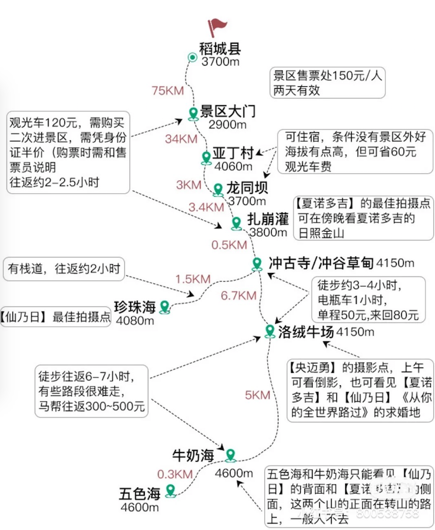

#																			川藏

## 准备物品

- 证件

  - 身份证、驾驶证、银行卡、现金

- 衣服

  - 羽绒服、冲锋衣、毛衣、头巾
  - 防晒衣、帽子、太阳镜
  - 拖鞋、一次性内衣

- 生活用品

  - 防晒霜、唇膏、沐浴露、洗发水、护发素、牙刷、牙膏、护肤化妆品

  - 脖枕、雨伞、纸巾、保温杯、防蚊丁、垃圾袋

- 食品

  - 矿泉水、巧克力、糖果、薯片、果冻、饼干、自热锅（米饭、火锅）、红牛、零食、水果、泡面、面包、干果类（话梅、果干、蜜饯）、坚果

- 药品

  - 感冒药：快克、板蓝根、藿香正气水
  - 肠胃药：泻立停、吗叮呤
  - 消炎药：
  - 晕车药：
  - 高反药：红景天、高原安、高原维能、葡萄糖、西洋参含片
  - 外用：云南白药、创可贴、氧气瓶

- 健康码

  - 提前截图

## 路线

### 全程路线

### Day1(10.2)： 成都-雅安-泸定桥-海螺沟(316KM,约5小时)

**住宿：海螺沟（海拔2000-3000左右）**

**沿途风光：**

- 雨城雅安
- 青衣江河谷风光
- 二郎山高山隧道
- 泸定桥
- 摩西古镇
- 海螺沟

### Day2(10.3)： 海螺沟-红石滩-康定折多山-新都桥(176KM,约4个半小时)

**住宿：新都桥（海拔3600）**

**沿途风光：**

- 蜀山之王贡嘎
- 红石公园
- 雅家梗
- 康巴第一关折多山
- 摄影天堂新都桥

### ⚠️ Day3(10.4)： 新都桥-理塘-稻城-香格里拉镇(417KM,约7小时)**

**住宿：香格里拉镇（海拔2900）**

**沿途风光：**

- 高原山城雅江
- 世界高城理塘
- 兔儿山
- 稻城古冰帽海子山

### **Day4(10.5)： 亚丁景区一日游**

**住宿：香格里拉镇（海拔2900）稻城（海拔3700）**

**沿途风光：**

- 落绒牛场
- 冲古草甸
- 央迈勇
- 夏诺多吉
- 牛奶海
- 五色湖
- 珍珠海

### **⚠️ Day5(10.6)： 亚丁-毛娅草原-姊妹湖-巴塘(428KM, 约7个半小时)**	

**住宿：巴塘（海拔2500）**

**沿途风光：**

- 桑堆红草地
- 毛娅草原
- 姊妹湖
- 格聂神山
- 长青春科尔寺

### ⚠️ Day6(10.7)： 巴塘-芒康-左贡-东达山-怒江72拐-八宿(456KM,约9小时)

**住宿：八宿（海拔3200）**

**沿途风光：**

- 竹巴龙自然保护区
- 三江流域（金沙江、澜沧江、怒江）
- 邦达草原
- 怒江72拐
- 红拉雪山

### ⚠️Day7(10.8)：八宿-安久拉山-然乌湖-来古冰川-波密-通麦-鲁朗-色季拉山垭口-林芝(445KM,约8小时)

**住宿：林芝（海拔3100）**

**沿途风光：**

- 然乌湖

- 米堆冰川

- 帕隆藏布江畔风光

- 古乡湖

- 通麦大桥

- 鲁朗林海（长约15公里、宽约1公里）

- 色季拉山

- 南迦巴瓦峰（7782米、世界第15高峰）

  

### Day8(10.9)： 林芝-米拉山-拉萨(391KM,约5小时)

**住宿：拉萨（海拔3600）**

**沿途风光：**

- 高原江南林芝
- 尼洋河风光
- 米拉山
- 日光城拉萨

### Day9(10.10)：拉萨-羊卓雍措-拉萨(往返422KM,约8个半小时)

**住宿：拉萨（海拔3600）**

**沿途风光：**

- 羊卓雍错湖
- 布达拉宫

